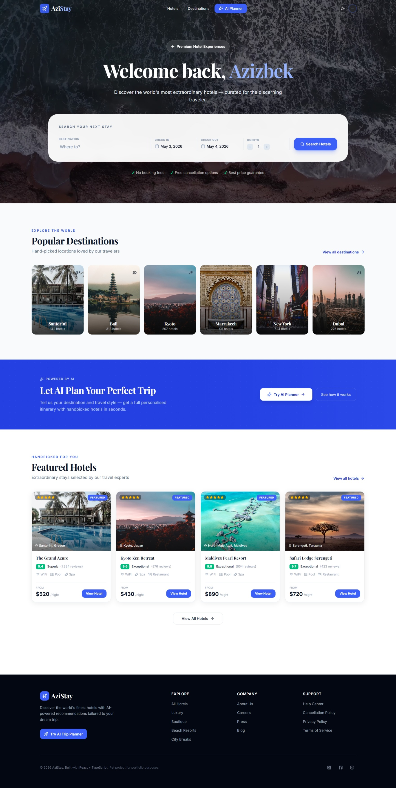
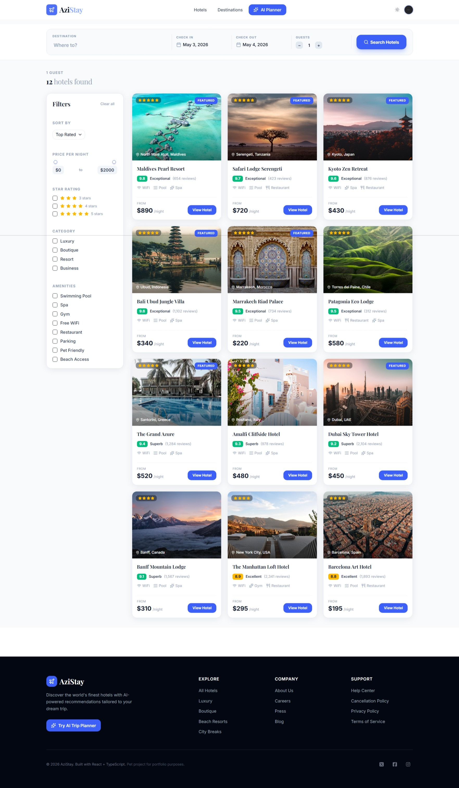
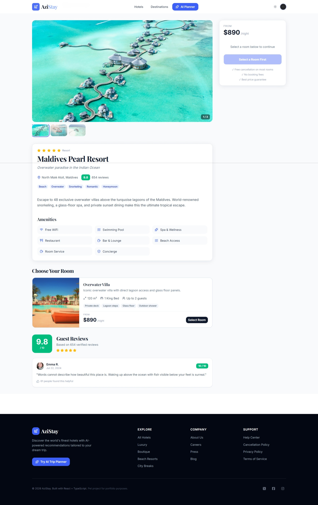
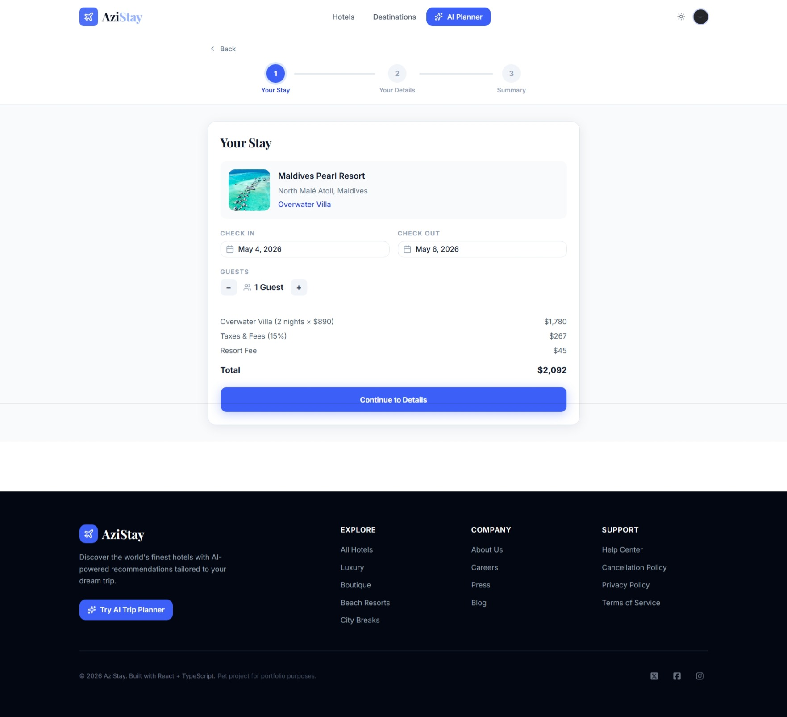
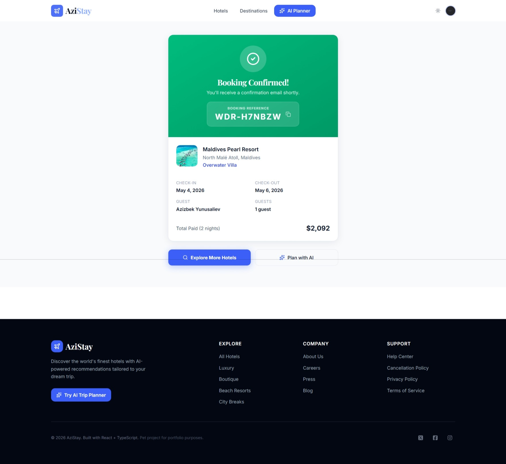

# ✈️ AziStay — AI-Powered Hotel Booking Platform

A modern, full-featured hotel booking web application with an AI Trip Planner,
built as a portfolio project to demonstrate frontend engineering skills.


🔗 **Live Demo:** [azistay.vercel.app](https://azistay.vercel.app)
📁 **GitHub:** [github.com/azick99/azistay](https://github.com/azick99/azistay)

## 📸 Screenshots

| Home Page                             | Search Results                            | Hotel Detail                              |
| ------------------------------------- | ----------------------------------------- | ----------------------------------------- |
|  |  |  |

| Booking Flow                                | Confirmation                                          |
| ------------------------------------------- | ----------------------------------------------------- |
|  |  |

## ✨ Features

### 🏨 Core Booking Experience

- 🔍 **Hotel Search** — Search by destination, dates, and guest count
- 🎛️ **Advanced Filters** — Filter by price, star rating, category, and amenities
- 🖼️ **Photo Gallery** — Full-screen lightbox with keyboard navigation
- 🛏️ **Room Selection** — Compare rooms with detailed info and availability
- 📋 **Multi-Step Booking** — Guided 3-step booking flow with validation
- ✅ **Booking Confirmation** — Unique booking reference generation

### 🤖 AI Trip Planner _(Phase 3 — Coming Soon)_

- Natural language trip planning powered by AI
- Personalized hotel recommendations
- Day-by-day itinerary generation
- Estimated budget breakdown

### 🔐 Authentication

- Secure sign-in / sign-up via **Clerk**
- Google & GitHub social login
- Protected routes for booking and AI planner
- User profile management

### 🎨 UI/UX

- Fully **responsive** — mobile-first design
- **Dark mode** toggle
- Smooth animations with **Framer Motion**
- Skeleton loading states
- Accessible components (ARIA)

---

## 🛠️ Tech Stack

| Category   | Technology               |
| ---------- | ------------------------ |
| Framework  | React 18 + Vite          |
| Language   | TypeScript               |
| Styling    | Tailwind CSS + shadcn/ui |
| Routing    | React Router v6          |
| State      | Zustand                  |
| Auth       | Clerk                    |
| Forms      | React Hook Form + Zod    |
| Animations | Framer Motion            |
| Icons      | Lucide React             |
| AI         | Gemini (flash 2.5 late)  |
| Deployment | Vercel                   |

---

## 🚀 Getting Started

### Prerequisites

- Node.js 18+
- npm or yarn
- Clerk account (free at [clerk.com](https://clerk.com))

### Installation

```bash
# 1. Clone the repo
git clone https://github.com/yourusername/azistay.git
cd azistay

# 2. Install dependencies
npm install

# 3. Set up environment variables
cp .env.example .env
# Fill in your keys (see Environment Variables section)

# 4. Start development server
npm run dev

```

# 5. Open in browser

http://localhost:5173

````

---

## 🔐 Environment Variables

Create a `.env` file in the root directory:

```bash
# Clerk Authentication (required)
VITE_CLERK_PUBLISHABLE_KEY=pk_test_xxxxxxxxxxxxxxxx

# AI Provider - Phase 3 (optional)
VITE_GEMINI_API_KEY=Aisxxxxxxxxxxxxxxxx
````

👉 Get your Clerk key at: https://clerk.com → Create Application → API Keys

---

## 📁 Project Structure

```
src/
├── ai/                 # AI client & prompts (Phase 3)
├── components/
│   ├── auth/           # ProtectedRoute
│   ├── hotels/         # HotelCard, PhotoGallery, RoomCard, Reviews
│   ├── booking/        # BookingSteps, BookingForm, Summary
│   ├── search/         # SearchBar, FilterSidebar
│   ├── ai/             # ChatWindow, MessageBubble (Phase 3)
│   └── layout/         # Navbar, Footer, PageLoader
├── data/               # Mock hotel data
├── hooks/              # Custom hooks
├── pages/              # Route-level pages
├── store/              # Zustand stores
├── types/              # TypeScript interfaces
└── lib/                # Utilities
```

---

## 🗺️ Roadmap

### ✅ Phase 1 — Foundation (Complete)

- Vite + React + TypeScript setup
- Tailwind CSS + shadcn/ui
- Routing structure
- Mock hotel data
- Navbar + Footer

### ✅ Phase 2 — Core Booking UI (Complete)

- Hero section + SearchBar
- Search results with filters + sorting
- Hotel detail page
- Room selection
- Multi-step booking flow
- Booking confirmation
- Clerk authentication

### ✅ Phase 3 — AI Trip Planner (Complete)

```
Files created:
  src/ai/prompts.ts              ✅
  src/ai/parseResponse.ts        ✅
  src/ai/geminiClient.ts         ✅
  src/store/useChatStore.ts      ✅
  src/hooks/useChat.ts           ✅
  src/components/ai/
    TypingIndicator.tsx          ✅
    ChatMessage.tsx              ✅
    ChatInput.tsx                ✅
    TripSuggestionCard.tsx       ✅
    ItineraryView.tsx            ✅
    BudgetBreakdown.tsx          ✅
    ResultsPanel.tsx             ✅
    ChatWindow.tsx               ✅
  src/pages/AITripPlannerPage.tsx ✅

Environment:
  VITE_GEMINI_API_KEY in .env    ✅
  Added to Vercel env vars       ✅
```

- [x] Google Gemini API integration
- [x] Natural language trip planning
- [x] 3 AI-matched hotel recommendations
- [x] Accordion day-by-day itinerary
- [x] Animated budget breakdown
- [x] Chat history with memory
- [x] Suggestion chips for quick start
- [x] Mobile responsive split layout

### 🔮 Phase 4 — Future Improvements

- Real hotel API (Amadeus / RapidAPI)
- Interactive maps (Leaflet)
- Booking history page
- Wishlist / saved hotels
- Email confirmations
- Admin dashboard
- i18n (multi-language)
- Performance optimizations
- Testing (Vitest + Testing Library)
- PWA support

---

## 🤔 Known Limitations

This is a **frontend-focused portfolio project**, so:

- ❌ No real payments (UI only — no Stripe)
- ❌ No backend (fully client-side)
- ❌ Uses mock hotel data (no real availability)
- ❌ AI responses are simulated / partial

---

## 🙏 Credits

- Images — Unsplash
- Avatars — Pravatar
- UI — shadcn/ui
- Auth — Clerk
- Icons — Lucide

---

## 👤 Author

**Your Name**

- Portfolio: https://https://azizbek-3-d-portfolio.vercel.app
- LinkedIn: https://www.linkedin.com/in/azizbek-yunusaliev-6b060b232/
- GitHub: https://github.com/azick99

---

## 📄 License

MIT License — feel free to use this project as inspiration.

---

## 🚀 Deploy Checklist

Before deploying to Vercel:

```bash
# 1. Ensure .env.example exists
echo "VITE_CLERK_PUBLISHABLE_KEY=" > .env.example

# 2. Ensure .env is ignored
echo ".env" >> .gitignore

# 3. Build locally
npm run build

# 4. Push to GitHub
git add .
git commit -m "feat: production ready"
git push

```

Then on Vercel:

- Import GitHub repo
- Add environment variables
- Deploy 🚀

```

```
